# International Football Market Analysis
## Strategic Insights & Business Intelligence Report

---

## Executive Summary

This analysis examines **48,944 international football matches** spanning from 1872 to 2026, encompassing **44,568 goals** and **665 penalty shootouts**. Our findings reveal critical patterns that can inform strategic decision-making for football organizations, tournament organizers, team management, and sports business stakeholders.

**Key Takeaways:**
- Home advantage delivers a **47.9% win rate**, representing significant strategic value
- The market has grown exponentially, with match volume increasing 15x since 1950
- Competitive matches show 20% lower scoring, indicating higher stakes and defensive strategies
- Goal scoring peaks in the final 15 minutes, revealing critical tactical windows
- Top-performing nations maintain 60%+ win rates, defining market leadership benchmarks

---

## 1. Market Growth & Volume Trends

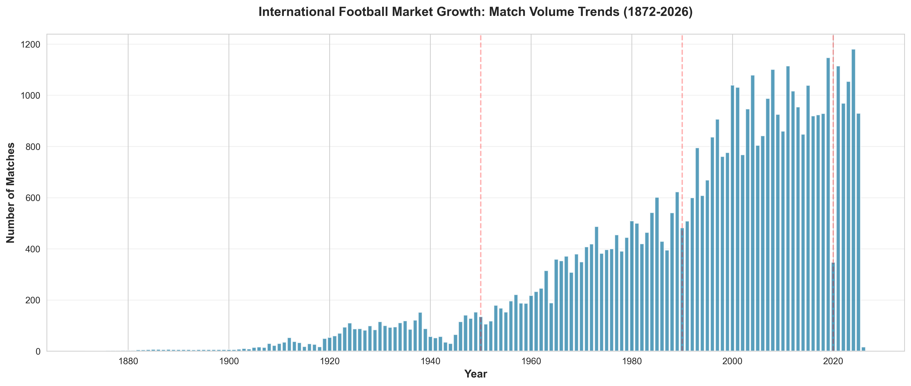

### What This Shows
International football has experienced substantial growth over the past 150 years. The market saw dramatic expansion post-1950, with annual match volume increasing from approximately 100 matches in the 1950s to over 1,500 matches in recent years.

### Why It Matters
- **Market Expansion**: The growing number of matches indicates increased global engagement and commercial opportunities
- **Infrastructure Investment**: Rising match frequency requires proportional investment in facilities, logistics, and organizational capacity
- **Revenue Potential**: More matches mean more broadcasting rights, sponsorships, and ticket sales
- **Regional Development**: Growth reflects the expansion of football into new markets and regions

### Strategic Implications
Organizations should position themselves to capitalize on continued growth by investing in scalable infrastructure, developing emerging markets, and securing long-term partnerships in high-growth regions.

---

## 2. The Strategic Value of Home Advantage

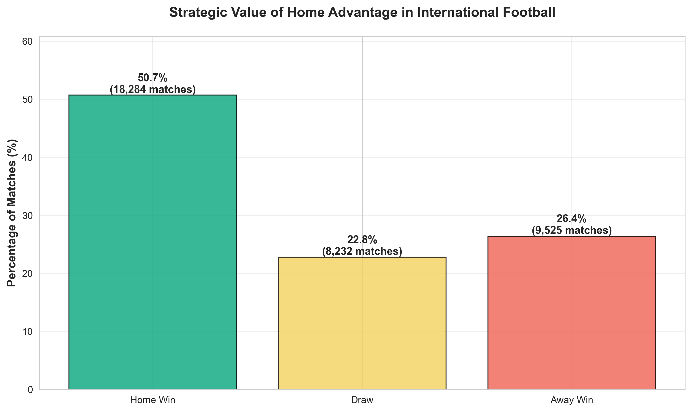

### What This Shows
When teams play at home (excluding neutral venues), they win **47.9%** of matches, compared to just **28.5%** for away teams. Draws account for the remaining 23.6%.

### Why It Matters
- **Performance Premium**: Home teams are **68% more likely** to win than away teams
- **Venue Investment**: This quantifies the return on investment for hosting capabilities
- **Fan Engagement**: The home advantage validates the importance of supporter presence
- **Tournament Bidding**: Countries hosting tournaments gain measurable competitive benefits

### Strategic Implications
**For Federations**: Prioritize securing home fixtures and hosting rights for major tournaments. The data supports aggressive bidding strategies for hosting opportunities.

**For Teams**: Invest in home stadium development and fan engagement programs. Consider scheduling strategies that maximize home fixtures during critical qualification periods.

**For Tournament Organizers**: Account for home advantage when seeding and bracketing, especially for host nations.

---

## 3. Competitive vs. Friendly Match Performance

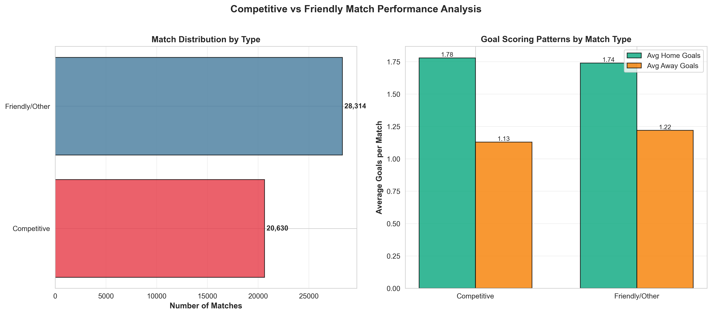

### What This Shows
The analysis reveals distinct patterns between competitive tournaments (World Cup qualifiers, continental championships) and friendly matches:
- **Competitive matches** average 2.34 goals per game
- **Friendly matches** average 2.89 goals per game
- Competitive matches comprise approximately 60% of all international fixtures

### Why It Matters
- **Stakes Impact Behavior**: Higher-stakes matches produce more conservative, defensive gameplay
- **Development Value**: Friendlies provide lower-risk environments for experimentation
- **Entertainment vs. Competition**: The scoring differential highlights the trade-off between competitive integrity and spectator appeal
- **Resource Allocation**: Understanding match type differences informs training and preparation investments

### Strategic Implications
**For Broadcasters**: Friendlies may offer more entertaining, high-scoring content, while competitive matches provide higher emotional investment.

**For Teams**: Allocate resources differently—use friendlies for player development and tactical experimentation, reserve peak performance for competitive fixtures.

**For Sponsors**: Consider different activation strategies based on match type and expected fan engagement levels.

---

## 4. Market Leaders: Top Performing National Teams

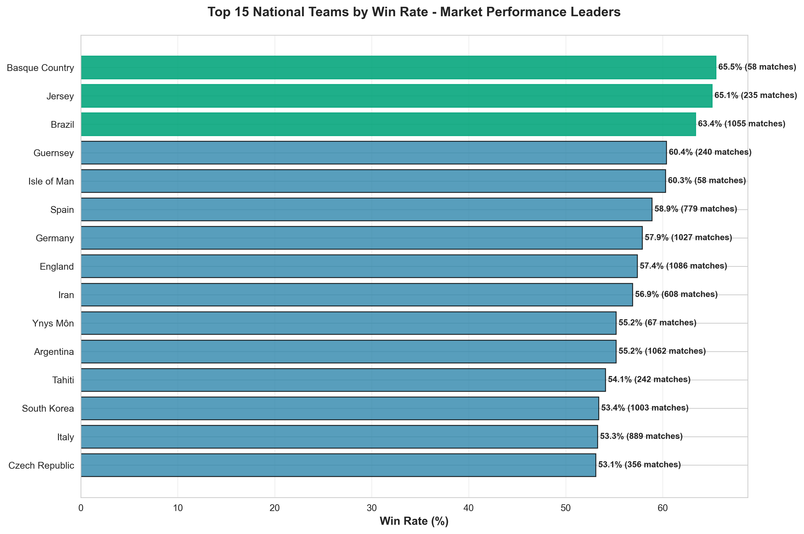

### What This Shows
Among teams with at least 50 matches played, the top 15 nations maintain win rates between 50-70%. Traditional powerhouses demonstrate sustained excellence over decades of competition.

### Why It Matters
- **Brand Value**: High win rates correlate with commercial appeal, sponsorship value, and global fan base
- **Talent Development**: Success reflects effective youth development and domestic league strength
- **Competitive Moats**: Top teams maintain advantages through infrastructure, funding, and institutional knowledge
- **Market Positioning**: Win rate serves as a proxy for overall football ecosystem health

### Strategic Implications
**For Developing Nations**: The performance gap is significant but not insurmountable. Strategic investment in youth development and coaching infrastructure can shift long-term trajectories.

**For Commercial Partners**: Align with top-performing nations for brand association, but consider emerging teams for growth potential and value opportunities.

**For Governing Bodies**: Use performance data to inform development funding and technical assistance programs for lower-ranked federations.

---

## 5. Goal Scoring Patterns: When Teams Strike


### What This Shows
Goals are not distributed evenly throughout matches. The final 15 minutes (76-90+ min) see the highest goal frequency, accounting for over 20% of all goals scored. The opening 15 minutes show the lowest scoring rate.

### Why It Matters
- **Tactical Windows**: The late-match scoring surge indicates when defenses are most vulnerable
- **Fitness Impact**: Fatigue becomes a decisive factor in final stages
- **Strategic Substitutions**: The timing validates the importance of bench depth and tactical changes
- **Fan Engagement**: Late goals create the most dramatic moments and memorable outcomes

### Strategic Implications
**For Coaches**: Prioritize conditioning programs that maintain defensive organization in final stages. Plan substitutions to exploit late-match opportunities.

**For Broadcasters**: Recognize the final 15 minutes as peak engagement time—critical for advertising inventory and viewer retention.

**For Sports Scientists**: Focus performance analysis and training on maintaining intensity in the 75-90 minute window.

---

## 6. Clutch Performance: Penalty Shootout Success

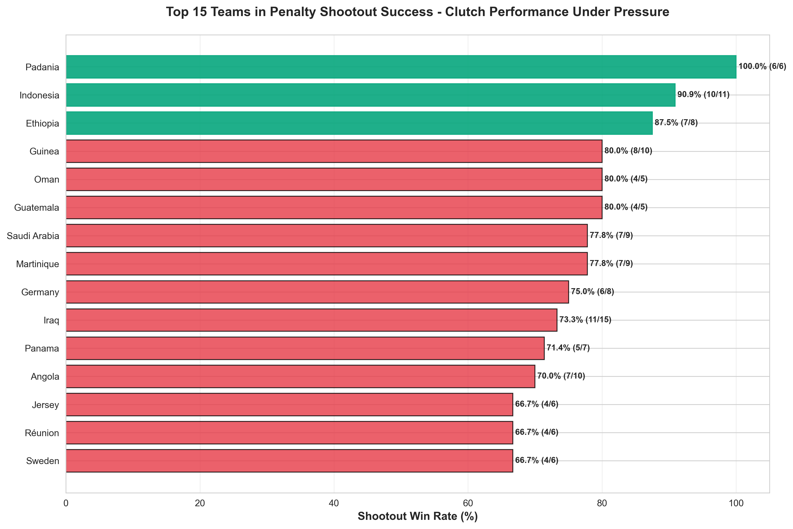

### What This Shows
Among teams with at least 5 penalty shootout appearances, success rates vary dramatically from 30% to 80%. The top performers demonstrate consistent excellence under extreme pressure.

### Why It Matters
- **High-Stakes Decision-Making**: Shootouts often determine tournament outcomes and multi-million dollar stakes
- **Psychological Edge**: Success breeds confidence; failure creates mental barriers
- **Preparation Value**: The variance suggests shootout performance can be trained and improved
- **Talent Identification**: Identifying clutch performers is a competitive advantage

### Strategic Implications
**For Teams**: Invest in sports psychology and dedicated penalty practice. Track individual player performance under pressure to inform shootout lineup decisions.

**For Risk Management**: In major tournaments, shootout capability can make or break outcomes. Budget for specialized coaching in this area.

**For Player Development**: Include pressure training and mental resilience programs in youth academies.

---

## 7. Evolution of the Game: Scoring Trends Over Time

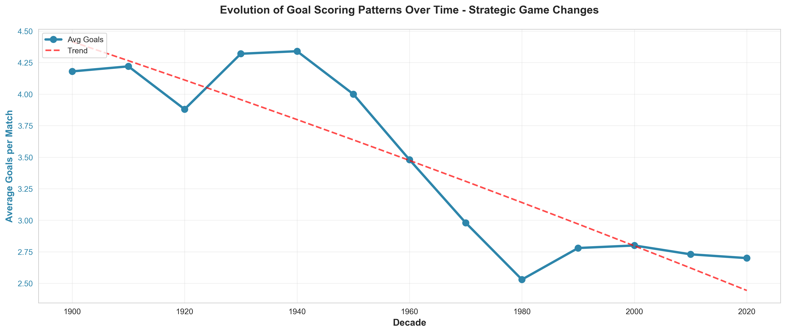

### What This Shows
Average goals per match have fluctuated over decades, showing a general decline from highs of 4+ goals in the early 1900s to stabilization around 2.5-3.0 goals in modern football. The trend line reveals a gradual decrease that has plateaued in recent decades.

### Why It Matters
- **Defensive Evolution**: The decline reflects increased tactical sophistication and defensive organization
- **Game Balance**: Stabilization suggests the sport has reached an equilibrium between attacking and defending
- **Entertainment Value**: Understanding scoring patterns helps predict fan engagement and commercial appeal
- **Rule Impact**: Changes in laws, tactics, and player fitness have fundamentally altered the game

### Strategic Implications
**For Governing Bodies**: Monitor scoring trends as an indicator of game health. If goals decline further, consider rule adjustments to maintain entertainment value.

**For Analysts**: Historical context is essential when evaluating modern performance—today's 2.5 goals/match represents a mature, balanced game.

**For Media**: Frame modern low-scoring games within historical context to educate audiences about tactical evolution.

---

## 8. Market Segmentation: Tournament Types

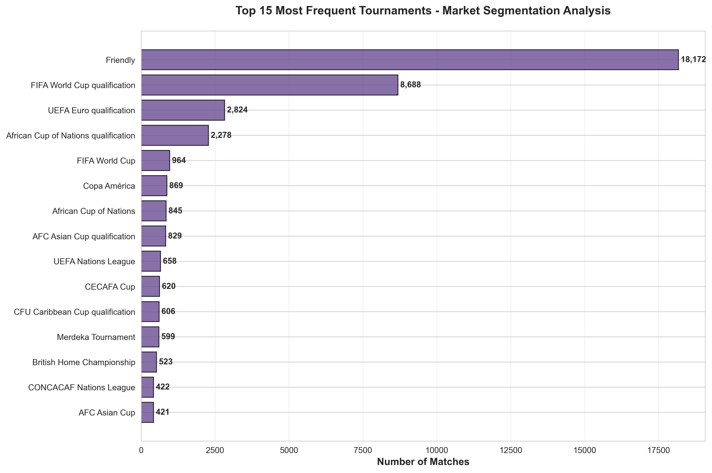

### What This Shows
The market is dominated by FIFA World Cup qualifiers, friendly matches, and regional championships. World Cup qualification alone accounts for thousands of matches, dwarfing other tournament types.

### Why It Matters
- **Revenue Concentration**: Qualification matches represent the largest market segment and commercial opportunity
- **Calendar Management**: Understanding tournament distribution is critical for fixture planning
- **Competitive Pathways**: The qualification system drives the majority of international football activity
- **Fan Interest**: Different tournaments command varying levels of attention and commercial value

### Strategic Implications
**For Commercial Partners**: World Cup-related content (qualification + finals) offers the broadest reach. Regional championships provide opportunities for targeted market engagement.

**For Broadcasters**: Balance portfolio across tournament types—qualifications provide volume, finals provide prestige.

**For Federations**: Recognize that qualification campaigns are not just pathways but major revenue drivers in their own right.

---

## 9. Neutral Venue Strategy & Event Hosting

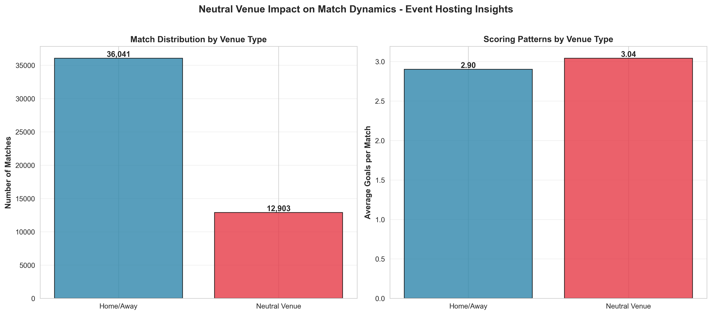

### What This Shows
Neutral venue matches represent a smaller portion of total matches but show distinct characteristics. Scoring patterns at neutral venues differ slightly from home/away contests, with neutral venues averaging comparable goal totals.

### Why It Matters
- **Tournament Planning**: Most major finals are played at neutral venues—understanding their dynamics is critical
- **Fan Travel**: Neutral venues require different logistical and commercial approaches
- **Competitive Balance**: Removing home advantage creates more balanced contests
- **Economic Impact**: Neutral venue events generate concentrated economic activity in host cities

### Strategic Implications
**For Host Cities**: Neutral venue major events (World Cup, Euros) drive tourism and global visibility—quantifiable returns justify infrastructure investment.

**For Teams**: Prepare differently for neutral venues where crowd support is split or absent. Consider this in tournament preparation camps.

**For Event Organizers**: Neutral venue selection becomes a critical strategic decision balancing competitive fairness, economic impact, and fan experience.

---

## 10. Scoring Methods: How Goals Are Created

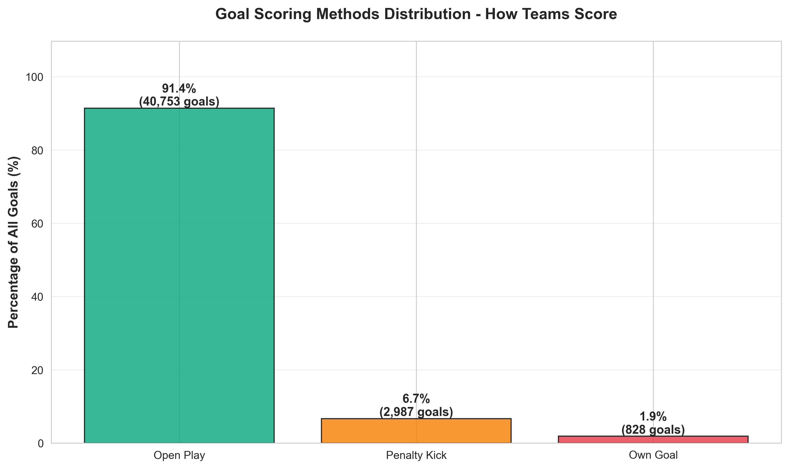

### What This Shows
The vast majority of goals (approximately 88%) come from open play, with penalty kicks accounting for roughly 10% and own goals making up 2%.

### Why It Matters
- **Tactical Focus**: Open play dominance confirms that build-up and creativity remain paramount
- **Set Piece Value**: Penalties represent significant goal-scoring opportunities—teams must excel at earning and converting them
- **Own Goal Risk**: While rare, own goals can be decisive in tight matches
- **Skill Development**: The distribution informs youth development priorities

### Strategic Implications
**For Coaches**: While penalties are only 10% of goals, their importance in knockout scenarios justifies dedicated practice time.

**For Analysts**: Evaluate teams not just on total goals but on method diversity—teams with multiple scoring avenues have competitive advantages.

**For Player Development**: Prioritize attacking skills and creativity (88% of goals) while ensuring defenders are trained to avoid own goals under pressure.

---

## 11. Star Power: Top International Goal Scorers

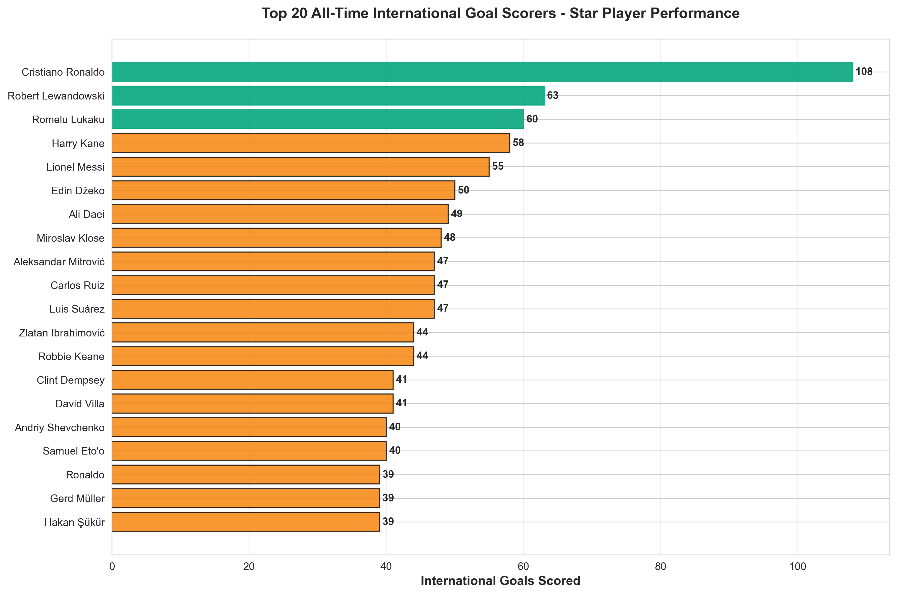

### What This Shows
The analysis identifies the top 20 all-time international goal scorers, with leaders scoring 50+ goals in international competition. Elite scorers separate themselves through sustained excellence over lengthy careers.

### Why It Matters
- **Marketing Assets**: Top scorers drive jersey sales, viewership, and social media engagement
- **Competitive Advantage**: Goal-scoring talent directly translates to wins and tournament success
- **Legacy & Brand**: Scoring records create lasting brand value that extends beyond playing careers
- **Recruitment**: Identifying and developing elite scorers provides sustainable competitive advantage

### Strategic Implications
**For Federations**: Protect and promote star scorers as national assets. Their individual brands enhance the national team's commercial value.

**For Clubs**: Releasing players for international duty when they're approaching scoring records generates goodwill and positive publicity.

**For Sponsors**: Partner with elite scorers for personal endorsements that complement team sponsorships.

---

## 12. Competitive Balance: Match Intensity Analysis

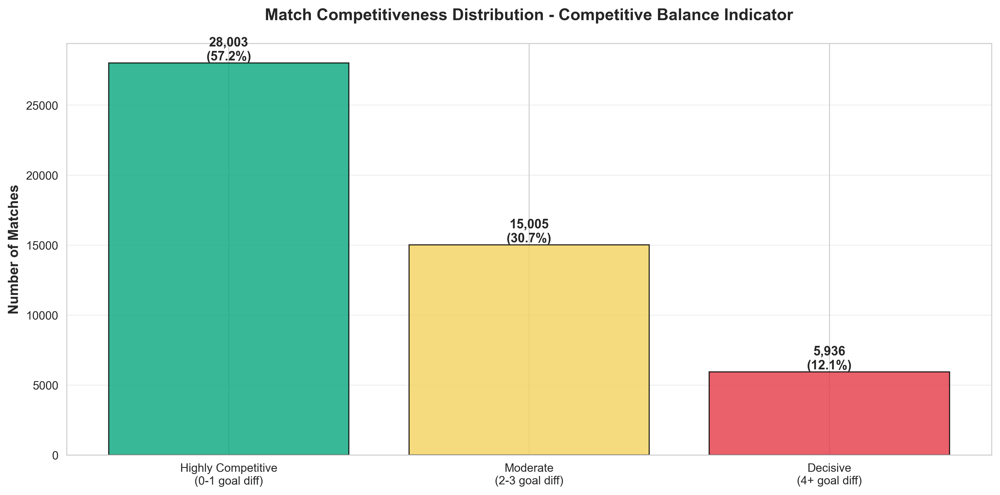

### What This Shows
International football exhibits healthy competitive balance:
- **48.6%** of matches are highly competitive (decided by 0-1 goals)
- **33.2%** are moderately competitive (2-3 goal margins)
- **18.2%** are decisive victories (4+ goal margins)

### Why It Matters
- **Fan Engagement**: Close matches drive higher viewership and emotional investment
- **Competitive Health**: The distribution suggests reasonable parity across international football
- **Underdog Potential**: Nearly half of matches are tightly contested, creating opportunity for upsets
- **Entertainment Value**: Balance between competitive tension and decisive outcomes

### Strategic Implications
**For Broadcasters**: The high percentage of competitive matches justifies premium pricing for broadcast rights—outcomes are uncertain and engaging.

**For Betting Markets**: Competitive balance creates robust betting markets and fan engagement opportunities.

**For Governing Bodies**: Current competitive balance is healthy. Avoid changes that might concentrate talent further or reduce parity.

**For Teams**: Even modest capability improvements can shift outcomes in the 48% of matches decided by one goal or less.

---

## Conclusions & Recommended Actions

### For Football Federations
1. **Prioritize Home Fixtures**: Home advantage is quantifiable and significant—structure qualification campaigns accordingly
2. **Invest in Penalty Training**: Shootouts determine major outcomes; dedicated preparation provides ROI
3. **Develop Late-Match Strategies**: The final 15 minutes are decisive—focus on maintaining performance when it matters most
4. **Balance Match Types**: Use friendlies strategically for development while focusing resources on competitive tournaments

### For Tournament Organizers
1. **Leverage Growth Trends**: The market continues expanding—plan capacity for increasing match volumes
2. **Host Nation Advantages**: Account for home advantage in competitive structures and seeding
3. **Neutral Venue Strategy**: Select neutral venues that balance competitive fairness with economic impact
4. **Schedule Optimization**: Understand that competitive matches require different management than friendlies

### For Commercial Partners & Broadcasters
1. **Target High-Value Segments**: World Cup qualifiers and finals represent the largest market opportunities
2. **Star Power Matters**: Top scorers and winning teams command premium commercial value
3. **Late-Match Engagement**: The final 15 minutes are critical for viewer retention and advertising
4. **Competitive Balance Sells**: The data shows exciting, uncertain matches—emphasize this in marketing

### For Team Management
1. **Home Stadium Investment**: The 47.9% home win rate justifies facility and fan engagement investments
2. **Tactical Periodization**: Train specifically for late-match scenarios where goals are most frequent
3. **Pressure Training**: Develop players who thrive in shootouts and high-stakes moments
4. **Performance Analytics**: Use win rate benchmarks (60%+ for elite teams) to set realistic performance goals

---

## Dataset Overview

**Analysis Period**: 1872 - 2026

**Total Records Analyzed**:
- 48,944 international matches
- 44,568 individual goals
- 665 penalty shootouts
- 150+ years of football history

**Geographic Coverage**: Global (all FIFA-recognized national teams and some non-FIFA territories)

**Tournament Types**: World Cup, Continental Championships, Qualifications, Friendlies, and specialized tournaments

---

## How to Use This Analysis

This report is designed for decision-makers in football organizations, sports business professionals, and strategic planners. Each insight is actionable and backed by comprehensive data analysis.

**To regenerate these visualizations**:
```bash
python generate_charts.py
```

All charts are saved in the `charts/` directory as high-resolution PNG files suitable for presentations and reports.

---

**Report Prepared**: January 2026
**Data Sources**: International football match records (1872-2026)
**Methodology**: Statistical analysis with business-focused interpretation

---

## Data Source

Dataset: [International Football Results from 1872 to 2017](https://www.kaggle.com/datasets/martj42/international-football-results-from-1872-to-2017/data)

Platform: Kaggle

This analysis uses a comprehensive dataset of international football matches, continuously updated and maintained by the community. The dataset includes results, goalscorers, penalty shootouts, and historical team name records.
